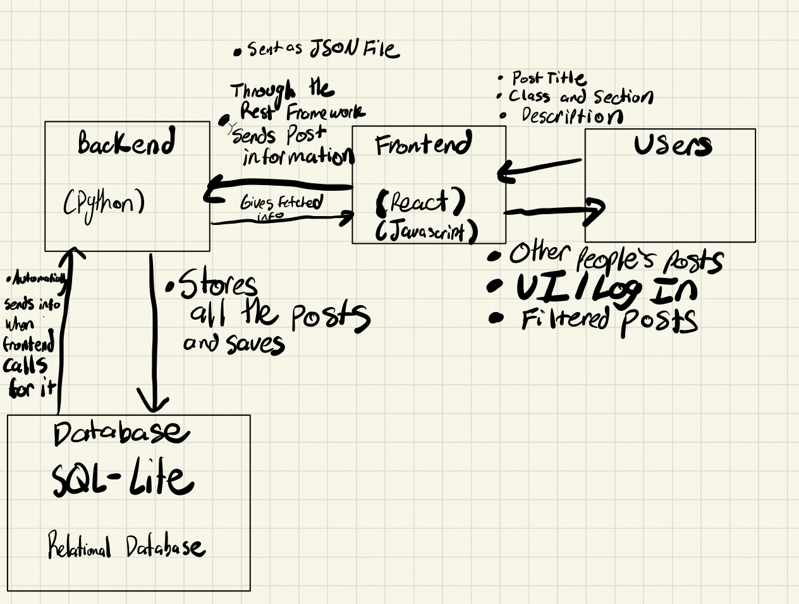

# BuddyUp

## Introduction
Students who come to college can often feel isolated. At such a large school with students of similar ages, we want to bring people together. We want to bring together students at school by connecting each other. Our web app will allow students to connect to one another by setting up posts where several students can meet and study for classes.

Our website called BuddyUp is a platform for students to look for discussion/ study group partners. Users can upload posts with details of the group, including class and section, as well as other important details such as location and time. The posts can also be categorized by classes and allow filters on the posts (e.g. available time and day). Users can reply to the posts to join the group.  Furthermore, logged-in users can view their profile page, which allows users to find the groups that they joined. Our website differs from other discussion and social websites since our website is created for students so that they can have a better study and college experience.

## Technical Architecture

### Frontend 
- Made with React and Javascript
- Displays data to users and shows off posts to users with login page

### Backend 
- Made with Python to fetch data from database to display in front end
- Does heavy lifting of filtering posts and sends to front end with the REST API.

### Database
- Made with SQL-Lite database
- Stores all the posts

## Installation and Usage
1. Clone the repo
2. Install python 
3. Install npm
4. Install django 
5. Run `python manage.py runserver` under `website` folder
6. Open another terminal
7. Run `npm start` under `website/frontend` folder
8. Open the link in the terminal to visit our website

## Group Members
- Pai Zheng (Backend)
- Anushant Singh (Frontend)
- Rishi Shah (Backend)
- Youngbo Sohn (Frontend)
